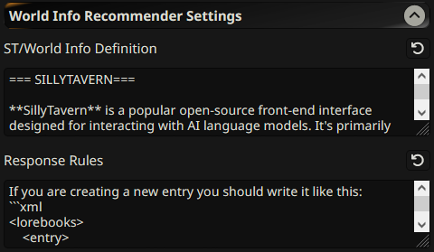

# SillyTavern World Info Recommender

**To use the extension, you need to be on the `staging` branch of SillyTavern.**

## Overview

A [SillyTavern](https://docs.sillytavern.app/) extension that recommends [world info](https://docs.sillytavern.app/usage/core-concepts/worldinfo/) based on the current context.


---



---

**If you are using a _Text Completion_ profile, make sure your profile contains API, preset, model, system prompt, instruct template, and  context template.**

**If you are using a _Chat Completion_ profile; API, settings, model would be enough.**

---

## Installation

Install via the SillyTavern extension installer:

```txt
https://github.com/bmen25124/SillyTavern-WorldInfo-Recommender
```

## Demo Video

## FAQ

>Can I use this with my local 8B/12B RP model?

You should test it, but my guess is no. Because model need to give _XML_ output. RP models might not be able to do that.

>Can you suggest a model?

Gemini models are cheap, fast and efficient. I usually use Gemini Flash 2.0. But most decent models should work fine.
